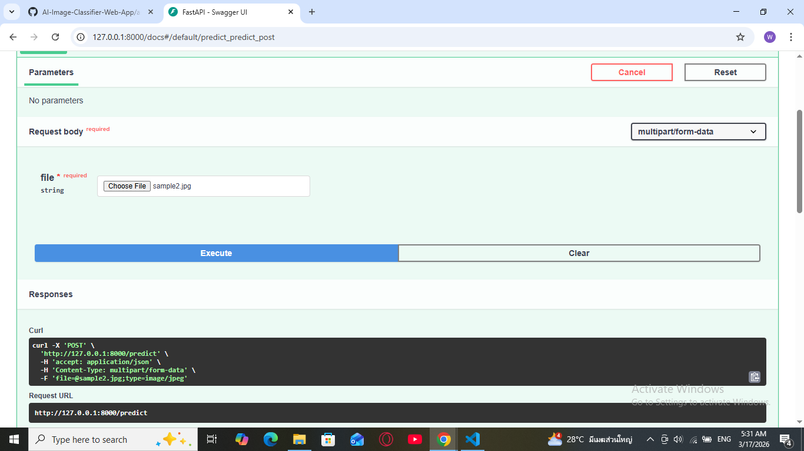
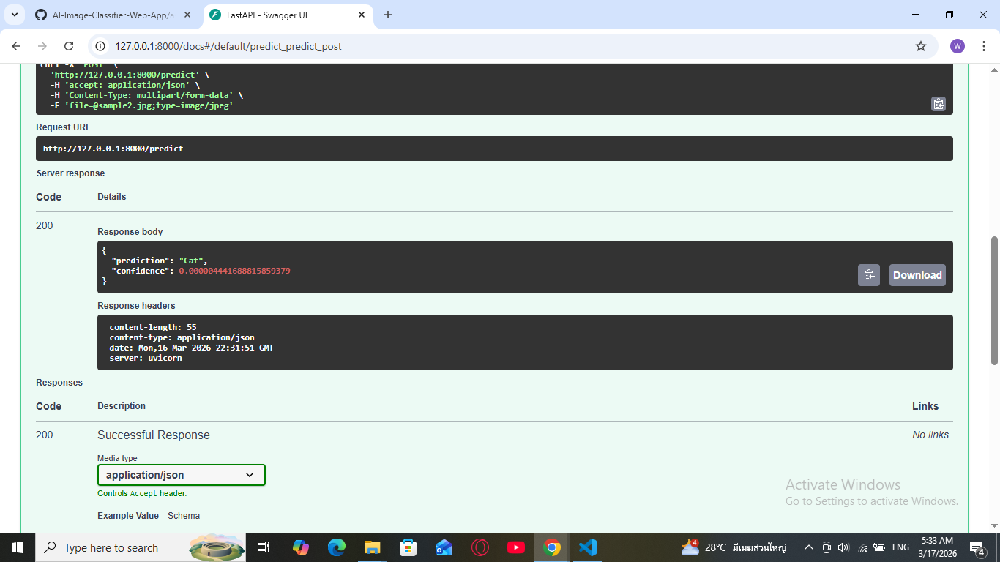
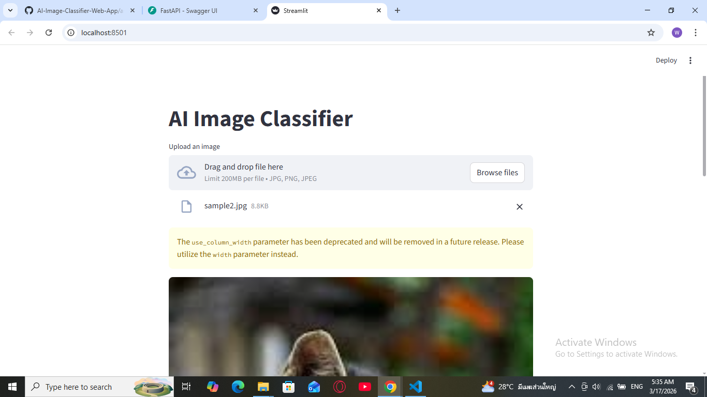
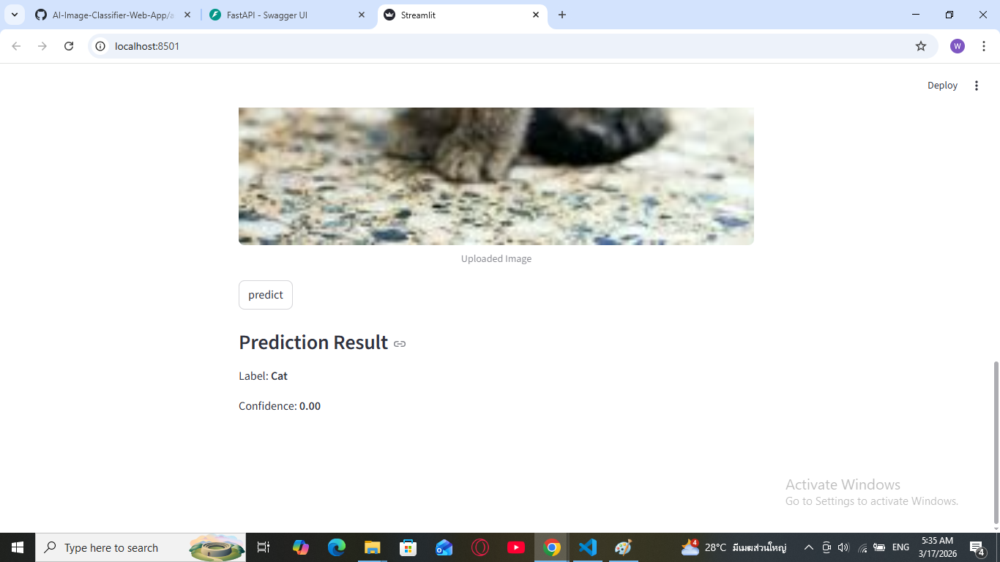
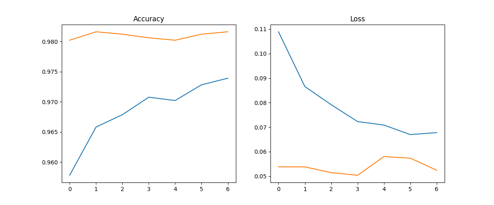

# AI Image Classifier Web App


An **AI-powered Image Classification Web Application** that predicts image categories using TensorFlow, MobileNetV2 Transfer Learning, FastAPI, and Streamlit.
Users can upload an image through a simple web interface and the system will automatically classify the image using the trained AI model.

---

## Project Overview

This project demonstrates a complete end-to-end AI application pipeline:

Dataset → Model Training → API Development → Web Interface → Cloud Deployment.

The model is built using **MobileNetV2 Transfer Learning**, a pretrained convolutional neural network trained on the **ImageNet dataset**.

Instead of training a deep neural network from scratch, this project reuses pretrained feature extraction layers from MobileNetV2 and adds custom classification layers on top.

This approach provides:

• Faster training  
• High accuracy with smaller datasets  
• Efficient model size suitable for web deployment

---

# Live Demo

Streamlit Dashboard  
[https://your-streamlit-render-url.onrender.com](https://ai-image-classifier-web-app-streamlit.onrender.com)

FastAPI API  
[https://your-api-render-url.onrender.com](https://ai-image-classifier-web-app-fastapi-an8f.onrender.com)

API Documentation  
[https://your-api-render-url.onrender.com/docs](https://ai-image-classifier-web-app-fastapi-an8f.onrender.com)

---

# Screenshot

## Screenshot






---


## Model Architecture

The image classifier is built using **MobileNetV2 Transfer Learning**.

Architecture overview:

Input Image (224,224)

↓

MobileNetV2 Pretrained Base (Feature Extraction)

↓

Global Average Pooling Layer

↓

Dense Layer

↓

Softmax Output Layer

The MobileNetV2 base layers are frozen during training to preserve pretrained features, while the final classification layers are trained on the custom dataset.

---

# Model Performance

| Metric | Value |
|------|------|
| Training Accuracy | 97.39% |
| Validation Accuracy | 98.16% |
| Training Loss | 0.0678 |
| Validation Loss | 0.0524 |

The model shows excellent performance.

---

# Training Visualization

The following graph shows the training results of the CNN model.



The graph includes:

- Training Accuracy
- Validation Accuracy
- Training Loss
- Validation Loss

---

## ✨ Features

- Upload an image directly from your device
- AI model predicts the image category
- Simple and user-friendly interface
- Built with Python and Streamlit
- Real-time predictions

---


# Tech Stack

### Programming Language
- Python

### Deep Learning
- TensorFlow
- Keras
- MobileNetV2 (Transfer Learning)

### Backend
- FastAPI

### Data Processing
- NumPy
- pillow(PIL)

### Visualization
- Matplotlib
- streamlit

---

## 🖥️ Web Interface (Streamlit)

The frontend of this application is built using **Streamlit**.

Streamlit allows you to easily create interactive web apps using only Python.

Users can:

1. Upload an image
2. View the uploaded image
3. Run the classifier
4. See the prediction result instantly

Example Streamlit components used:

- `st.file_uploader`
- `st.image`
- `st.button`
- `st.write`

---


# System Architecture


User Image

↓

FastAPI API

↓

Image Preprocessing

↓

MobileNet V2 CNN Model

↓

Prediction Result

↓

Streamlit Web view


---

## 📂 Project Structure

```text
ai-image-classifier-web-app
│
├── api
│   └── main.py
│
├── dashboard
│   └── app.py
├── model
│   └── train_model.py
    └── image_model.h5
├── dataset
│   ├── train
│   └── test
├── requirements.txt
└── README.md
└── training_results.png
```

📷 How to Use

Open the web application

Upload an image using the upload button

The AI model processes the image

The predicted class will be displayed

---

# Installation

Clone the repository


git clone https://github.com/your-username/ai-image-classifier.git


Navigate to project folder


cd ai-image-classifier


Install dependencies


pip install -r requirements.txt


---

# Train the Model

Run the training script


python train_model.py


The trained model will be saved as


model/image_model.h5


---

# Run FastAPI Server

Start the API server


uvicorn api.main:app --reload


API will run at


http://127.0.0.1:8000


API documentation


http://127.0.0.1:8000/docs


---

# API Example

### POST Request


POST /predict


Upload an image file and the API will return the predicted class.

Example Response

```json
{
  "prediction": "Cat",
  "confidence": 0.94
}
```

---

#Future Improvements

Improve model accuracy using larger datasets

Add multi-class classification

Build a web frontend interface

Deploy the application to cloud platforms

Add model monitoring

---

## Author

**Wai Phyo Ko**  
Aspiring Python / AI Developer

🔗 **GitHub:** [wpko](https://github.com/wpko)
